# FadeChain — ZK Time-Decay Voting System

> Privacy-preserving on-chain voting where early votes carry more weight. Built with zk-SNARKs, Merkle trees, and Ethereum smart contracts.

See [configuration.md](configuration.md) for configuration details.

---

## Scenario

FadeChain addresses a core tension in digital governance: how to let voters participate anonymously while still producing publicly verifiable, tamper-proof results. It is designed for **DAOs, participatory budgeting platforms, and any governance context** where incentivising early, informed participation matters.

The system applies a **linear time-decay weight** to each vote: a ballot cast at the opening of a voting window carries full weight (100%), while one cast at the very end approaches 0%. This discourages bandwagon behaviour — voters cannot simply wait to see how others voted and then pile on.

Deploying the logic as an **Ethereum smart contract** makes the rules immutable after deployment; no admin can silently change parameters mid-election. Using **zk-SNARKs (Groth16)** allows every voter to prove eligibility without revealing *which* registered voter they are, preserving ballot secrecy while keeping the tally fully auditable on-chain.

---

## Actors and Assumptions

| Actor | Trust level | What they see on-chain |
|---|---|---|
| **Admin** | Assumed honest | All contract parameters; cannot change immutables post-deploy |
| **Voters** | Honest-but-privacy-sensitive | Only their own nullifier/secret (kept off-chain) |
| **Relayer** | Semi-trusted | The ZK proof and vote choice, but not the voter's identity |
| **Smart contract** | Trustless | Commitments, nullifier hashes, weighted tallies, Merkle root |
| **Adversary** | Potentially malicious | Everything visible on-chain (commitments, timestamps, tallies) |

**Public on-chain:** voter commitments, nullifier hashes (after voting), vote weights, timestamps, cumulative tallies, Merkle root.  
**Private (off-chain only):** the raw `nullifier` and `secret` that generate each commitment; voter identity.

---

## Protocol

### Phase 1 — Registration
1. Each voter locally generates a random `nullifier` and `secret`.
2. They compute `commitment = hash(nullifier, secret)` and submit it to the contract.
3. The contract inserts the commitment as a leaf in an **incremental Merkle tree** (depth 20, ~1 M voters).
4. The admin calls `closeRegistration()`, which freezes the Merkle root. No further registrations are accepted.

### Phase 2 — Proof Generation (off-chain)
5. The voter selects a vote choice and generates a **ZK proof** demonstrating: *"I know a `(nullifier, secret)` whose commitment is a leaf in the frozen Merkle tree"* — without revealing which leaf.
6. The proof also binds the `nullifierHash = hash(nullifier)` and the chosen vote option.

### Phase 3 — Vote Submission & Tallying
7. The voter (or a relayer on their behalf) submits the proof, vote choice, and nullifier hash to the contract.
8. The contract: (a) verifies the ZK proof, (b) checks the nullifier hash has not been used, (c) computes the vote weight from `block.timestamp`, (d) records the nullifier as spent, and (e) adds the weighted vote to the running tally.
9. After `votingEnd`, the cumulative weighted tallies are permanently readable on-chain.

```mermaid
    flowchart TB
        classDef onchain fill:#0f2027,stroke:#00d4ff,stroke-width:2px,color:#e0f7ff
        classDef offchain fill:#1a0a2e,stroke:#bf5fff,stroke-width:2px,color:#f0e0ff
        classDef decision fill:#0d1f0d,stroke:#39ff14,stroke-width:2px,color:#ccffcc
        classDef result fill:#1f0a0a,stroke:#ff4444,stroke-width:2px,color:#ffe0e0
        classDef phase fill:#111,stroke:#555,stroke-width:1px,color:#aaa,font-style:italic

        %% ─── PHASE 0 ───
        F0(["⚙️ PHASE 0 · Deployment"]):::phase
        F0 --> A["🏛️ Admin deploys smart contract · Voting start/end time · Candidate options · Immutable security parameters"]:::onchain

        %% ─── PHASE 1 ───
        A --> F1(["🔐 PHASE 1 · Registration"]):::phase
        F1 --> B["🎲 Voter locally generates nullifier + secret"]:::offchain
        B --> C["#️⃣ Computes commitment: hash(nullifier, secret)"]:::offchain
        C --> D["📤 Sends commitment to contract on-chain"]:::onchain
        D --> E["🌳 Commitment inserted into Merkle Tree"]:::onchain

        %% ─── PHASE 2 ───
        E --> F2(["🔒 PHASE 2 · Transition"]):::phase
        F2 --> F["❄️ Registration CLOSED · Merkle Root FROZEN"]:::onchain

        %% ─── PHASE 3 ───
        F --> F3(["🧮 PHASE 3 · ZK Proof Generation (off-chain)"]):::phase
        F3 --> G["🗳️ Voter selects their vote choice"]:::offchain
        G --> H["⚡ Browser/client generates Zero-Knowledge Proof · Proves: commitment ∈ MerkleTree · Without revealing: voter identity"]:::offchain

        %% ─── PHASE 4 ───
        H --> F4(["📡 PHASE 4 · Vote Submission"]):::phase
        F4 --> I["🔁 Relayer receives ZK Proof + vote"]:::offchain
        I --> J["📨 Relayer submits tx on-chain · pays gas fees · Voter wallet NOT linked to vote"]:::onchain

        %% ─── PHASE 5 ───
        J --> F5(["✅ PHASE 5 · On-chain Verification"]):::phase
        F5 --> K{{"🔍 Nullifier already used?"}}:::decision
        K -- "Yes → Double vote" --> L["🚫 Transaction REJECTED"]:::result
        K -- "No → Continue" --> M{{"🔬 ZK Proof valid?"}}:::decision
        M -- "Invalid" --> N["🚫 Proof REJECTED"]:::result
        M -- "Valid ✓" --> O["✅ Nullifier marked as spent"]:::onchain

        %% ─── PHASE 6 ───
        O --> F6(["⏱️ PHASE 6 · Weighted Count with Temporal Decay"]):::phase
        F6 --> P["⏰ Contract captures exact tx timestamp"]:::onchain
        P --> Q["📉 Computes vote weight via decay function: w = f(t_vote, t_start, t_end)"]:::onchain
        Q --> R["➕ Adds weighted vote to cumulative tally"]:::onchain
        R --> S{{"⏳ Voting period still active?"}}:::decision
        S -- "Yes" --> F3
        S -- "No → End" --> T["📊 FINAL RESULTS · Public · Auditable · Immutable · Permanently on-chain"]:::result
```

### Failure cases
- **Invalid ZK proof** → transaction reverted.
- **Double-vote attempt** → nullifier already marked spent; transaction reverted.
- **Vote weight below 5% minimum** (`MIN_WEIGHT`) → transaction reverted.
- **Vote outside the time window** → contract checks `block.timestamp` against `votingStart`/`votingEnd`; reverted if outside.
- **Registration not closed before `votingStart`** → voting cannot proceed until `closeRegistration()` is called.

---

## Threats and Attacks

| Attack | Impact | Mitigation |
|---|---|---|
| **Double voting** | Voter inflates their influence | Each `nullifierHash` is stored on-chain after first use; any reuse is rejected |
| **Linking votes to wallets** | Breaks ballot secrecy | A **relayer** submits transactions, paying gas from its own address; voter wallet never appears on-chain |
| **Fake voter (unregistered)** | Ballot stuffing | Contract verifies Merkle membership via ZK proof; unregistered commitments cannot produce a valid proof |
| **Timestamp manipulation** | Validator boosts their vote weight | Ethereum PoS constrains block timestamps to within ~12 s of the expected slot; the 5% `MIN_WEIGHT` floor limits the marginal gain |
| **Admin parameter manipulation** | Rules changed mid-election | All critical parameters (`verifier`, `hasher`, `votingStart`, `votingEnd`, `numChoices`) are declared `immutable` in Solidity |

---

## Cryptographic Primitives

| Primitive | Role | Security property |
|---|---|---|
| **zk-SNARKs (Groth16)** | Prove Merkle membership and nullifier correctness without revealing identity | Zero-knowledge, soundness, succinctness (~128-byte proof, ~200 K gas to verify) |
| **Poseidon hash** | Compute commitments and nullifier hashes inside ZK circuits | ZK-friendly (~8× fewer constraints than SHA-256), collision-resistant |
| **Commitments** | Register voters without exposing their secret inputs | Hiding (commitment reveals nothing about nullifier/secret), binding (cannot be opened to a different value) |
| **Incremental Merkle tree** | Accumulate voter commitments; root used as public input to ZK proof | Efficient membership proofs; root uniquely determined by set of leaves |
| **Nullifier scheme** | Prevent double voting | Deterministic per voter (`hash(nullifier)`), unlinkable to commitment |

---

## How to Reproduce the Demo

**Dependencies:** MetaMask browser extension, Sepolia testnet ETH (~0.05 ETH from a faucet), [Remix IDE](https://remix.ethereum.org), Node.js 18+ (only if using the optional relayer).

1. **Deploy contracts in Remix** — compile `1_MockVerifier.sol`, `2_PoseidonT3Stub.sol`, and `3_ZKTimeDecayVoting.sol` (Solidity 0.8.20, optimiser 200 runs, EVM version `paris`) in that order. Deploy each to Sepolia via MetaMask and note all three contract addresses.

2. **Configure the frontend** — open `remix/frontend_remix_demo.html` in a browser. Paste the `ZKTimeDecayVoting` and `PoseidonT3Stub` addresses, select *MetaMask (direct)* mode, and click **Connect**.

3. **Register voters** — during the registration phase, click **Generate ZK Credentials** for each voter and save the displayed `nullifier`/`secret`. Click **Register Voter** to submit each commitment on-chain. When all voters are registered, the admin clicks **Close Registration** to freeze the Merkle root.

4. **Cast votes** — once `votingStart` is reached, select a vote option and click **Submit Vote**. The frontend generates a mock ZK proof compatible with the `MockGroth16Verifier` and submits the transaction. Votes cast earlier will display a higher weight percentage in the UI.

5. **View results** — after `votingEnd`, click **View Results** to read the weighted tally for each option directly from the contract.

> **Note:** The demo uses a `MockGroth16Verifier` that always returns `true`, enabling a full end-to-end flow without running the Circom circuit or a trusted setup ceremony. For production use, compile `circuits/vote.circom` with `circom` + `snarkjs`, run the two-phase trusted setup, and replace the mock verifier with the exported `Groth16Verifier.sol`.

---

*FadeChain — UPF Hackathon 2026, Cryptography & Security. Team: Gorka Hernandez · Sara López · Arnau Carbonell · Jordi Lleopart.*
